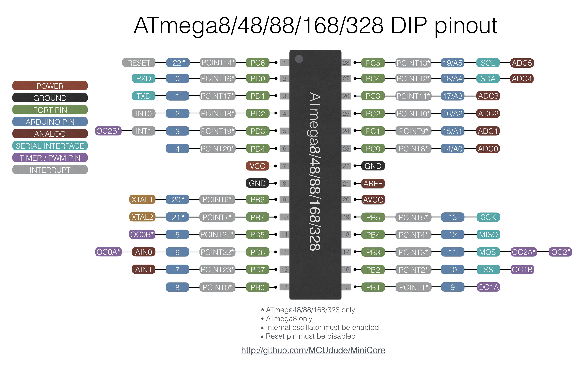
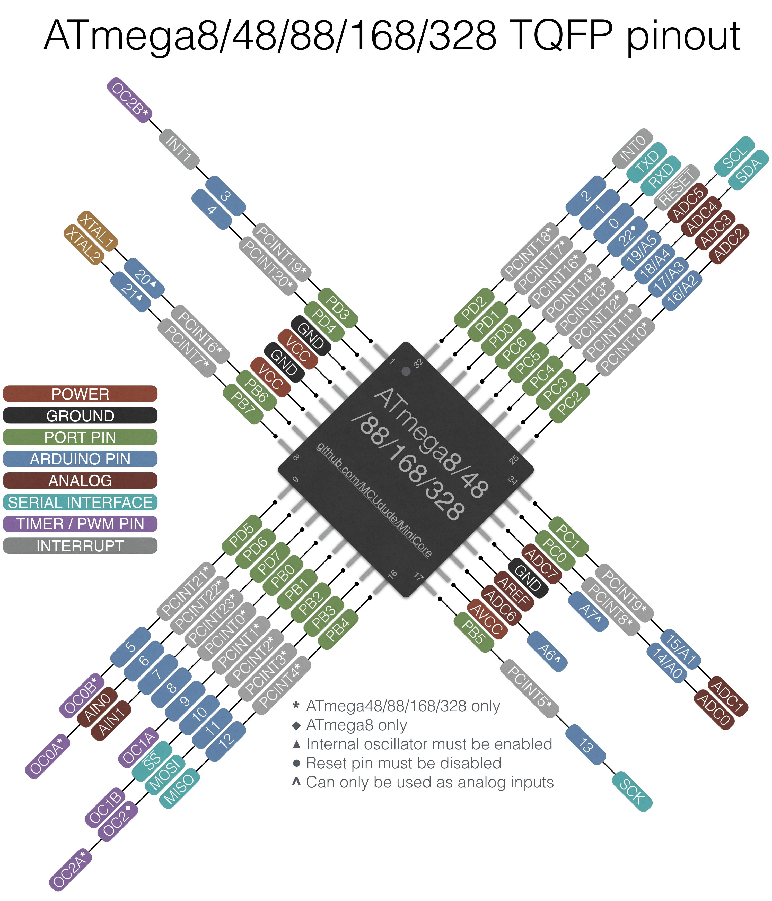
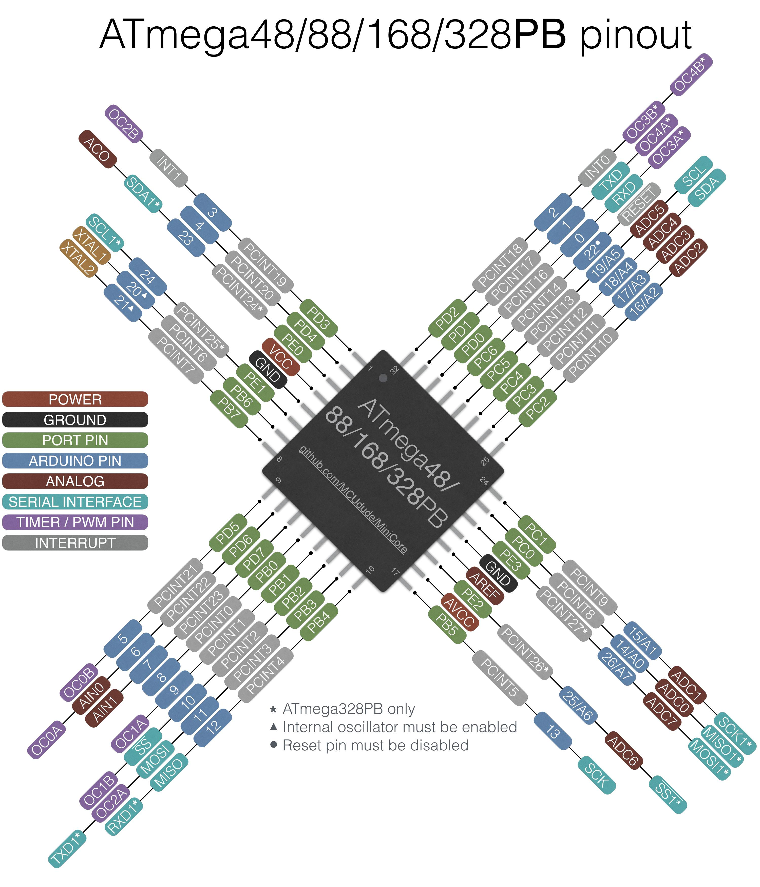
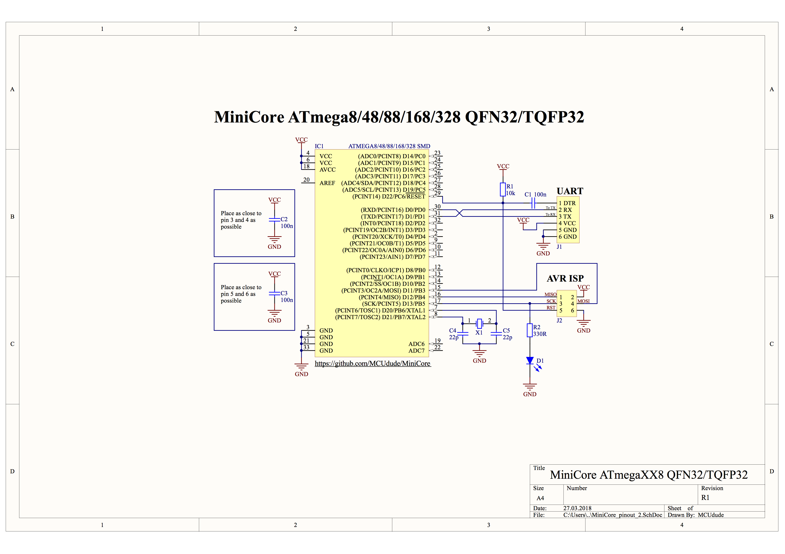
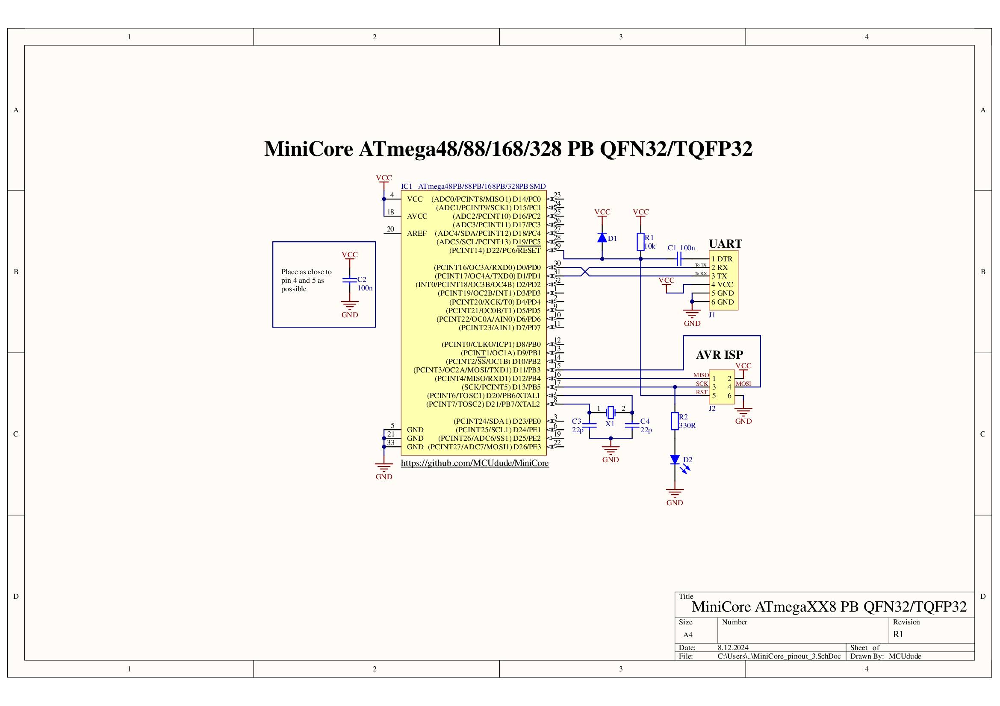

# MiniCore
[](https://forum.arduino.cc/index.php?topic=412070.0)

An Arduino core for the ATmega328, ATmega168, ATmega88, ATmega48 and ATmega8, all running the [Urboot](#write-to-own-flash) bootloader.
This core requires at least Arduino IDE v1.8, where v1.8.9 or newer is recommended. IDE 2.x should also work.

*From MiniCore version 3 and onwards, the Optiboot bootloader has been replaced by the superior [Urboot bootloader](https://github.com/stefanrueger/urboot/). It's smaller, faster, and has automatic baud rate detection, and can read and write to EEPROM. Other cool features the bootloader provides but are not utilized by MiniCore are user program metadata stored in flash (that can easily be viewed by Avrdude -xshowall) and chip-erase functionality.
If you already have Optiboot installed and don't want to replace it with Urboot, you can still upload programs without any compatibility issues. However, if you're burning a bootloader to a new chip, Urboot is the way to go.*

*From version 3.1.0 onwards, debugging in the Arduino IDE 2 is supported. You can use any of Microchip's EDBG-based hardware debuggers and the DYI debugger dw-link. For documentation, consult https://github.com/felias-fogg/dw-gdbserver.* 

**This core gives you two extra IO pins if you're using the internal oscillator!** PB6 and PB7 are mapped to [Arduino pin 20 and 21](#pinout).<br/>


# Table of contents
* [Supported microcontrollers](#supported-microcontrollers)
* [Supported clock frequencies](#supported-clock-frequencies)
* [Bootloader option](#bootloader-option)
* [Baud rate option](#baud-rate-option)
* [BOD option](#bod-option)
* [EEPROM retain option](#eeprom-option)
* [Link time optimization / LTO](#link-time-optimization--lto)
* [Printf support](#printf-support)
* [Pin macros](#pin-macros)
* [Write to own flash](#write-to-own-flash)
* [Programmers](#programmers)
* **[How to install](#how-to-install)**
	- [Boards Manager Installation](#boards-manager-installation)
	- [Manual Installation](#manual-installation)
	- [Arduino CLI Installation](#arduino-cli-installation)
	- [PlatformIO](#platformio)
* **[Getting started with MiniCore](#getting-started-with-minicore)**
* [Wiring reference](#wiring-reference)
* **[Pinout](#pinout)**
* **[Minimal setup](#minimal-setup)**


## Supported microcontrollers:
* ATmega8
* ATmega48
* ATmega88
* ATmega168
* ATmega328

<b>*</b> All variants (A, P, PA and PB)

|              |  ATmega328  | ATmega168 | ATmega88 | ATmega48 | ATmega8 |
|--------------|-------------|-----------|----------|----------|---------|
| **Flash**    | 32kB        | 16kB      | 8kB      | 4kB      | 8kB     |
| **RAM**      | 2kB         | 1kB       | 1kB      | 512B     | 1kB     |
| **EEPROM**   | 1kB         | 512B      | 512B     | 256B     | 512B    |
| **PWM pins** | 6/9<b>*</b> | 6         | 6        | 6        | 3       |

<b>*</b> ATmega328PB has 9 PWM pins


## Supported clock frequencies
MiniCore supports a variety of different clock frequencies. Select the microcontroller in the boards menu, then select the clock frequency. *You will have to hit "Burn bootloader" in order to set the correct fuses and upload the correct bootloader. This also has to be done if you want to change any of the fuse settings (BOD and EEPROM settings) regardless if a bootloader is installed or not*.

Make sure you connect an ISP programmer, and select the correct one in the "Programmers" menu. For time-critical operations, an external crystal/oscillator is recommended. The Urboot bootloader has automatic baud rate detection, so UART uploads should work fine even though the oscillator is a little too fast or too slow.

| Frequency   | Oscillator type             | Comment                                                       |
|-------------|-----------------------------|---------------------------------------------------------------|
| 16 MHz      | External crystal/oscillator | Default clock on most AVR-based Arduino boards and MiniCore   |
| 20 MHz      | External crystal/oscillator |                                                               |
| 18.4320 MHz | External crystal/oscillator | Great clock for UART communication with no error              |
| 14.7456 MHz | External crystal/oscillator | Great clock for UART communication with no error              |
| 12 MHz      | External crystal/oscillator |                                                               |
| 11.0592 MHz | External crystal/oscillator | Great clock for UART communication with no error              |
| 9.216 MHz   | External crystal/oscillator | Great clock for UART communication with no error              |
| 8 MHz       | External crystal/oscillator | Common clock when working with 3.3V                           |
| 7.3728 MHz  | External crystal/oscillator | Great clock for UART communication with no error              |
| 6 MHz       | External crystal/oscillator |                                                               |
| 4 MHz       | External crystal/oscillator |                                                               |
| 3.6864 MHz  | External crystal/oscillator | Great clock for UART communication with no error              |
| 2 MHz       | External crystal/oscillator |                                                               |
| 1.8432 MHz  | External crystal/oscillator | Great clock for UART communication with no error              |
| 1 MHz       | External crystal/oscillator |                                                               |
| 8 MHz       | Internal oscillator         |                                                               |
| 4 MHz       | Internal oscillator         | Derived from the 8 MHz internal oscillator                    |
| 2 MHz       | Internal oscillator         | Derived from the 8 MHz internal oscillator                    |
| 1 MHz       | Internal oscillator         | Derived from the 8 MHz internal oscillator                    |


## Bootloader option
MiniCore lets you select which serial port you want to use for uploading. UART0 is the default port for all targets, but ATmega328PB can also use UART1.
If your application doesn't need or require a bootloader for uploading you can also choose to disable it by selecting *No bootloader*.
This frees 384 bytes of flash memory on ATmega8/88/168/328 and 320 bytes on the ATmega48.

Note that you need to connect a programmer and hit **Burn bootloader** if you want to change any of the *Bootloader settings*.


# Baud rate option
Since Urboot has automatic baud rate detection, the upload baud rate can be changed without having to re-flash the bootloader. The default baud rate setting will pick a suited baud rate that also works with the legacy Optiboot bootloader used in earlier MiniCore versions.
The other baud rate options may or may not work, depending on the clock frequency and accuracy of the clock source. A rule of thumb is that "non-round" baud rates like 230400 works best with "non-round" clock speeds like 18.4320 MHz,
while "round" ones like 16 MHz work best with "round" baud rates like 250000.


## BOD option
Brown-out detection, or BOD for short lets the microcontroller sense the input voltage and shut down if the voltage goes below the brown-out setting. To change the BOD settings you'll have to connect an ISP programmer and hit "Burn bootloader". Below is a table that shows the available BOD options:
<br/>

| ATmega328 | ATmega168 | ATmega88 | ATmega48 | ATmega8  |
|-----------|-----------|----------|----------|----------|
| 4.3V      | 4.3V      | 4.3V     | 4.3V     | 4.0V     |
| 2.7V      | 2.7V      | 2.7V     | 2.7V     | 2.7V     |
| 1.8V      | 1.8V      | 1.8V     | 1.8V     | -        |
| Disabled  | Disabled  | Disabled | Disabled | Disabled |


## EEPROM option
If you want the EEPROM to be erased every time you burn the bootloader or upload using a programmer, you can turn off this option. You'll have to connect an ISP programmer and hit "Burn bootloader" to enable or disable EEPROM retain. Note that when uploading using a bootloader, the EEPROM will always be retained.

Note that if you're using an ISP programmer or have the Urboot bootloader installed, data specified in the user program using the `EEMEM` attribute will be uploaded to EEPROM when you upload your program in Arduino IDE. This feature is not available when using the older Optiboot bootloader.

```cpp
#include <avr/eeprom.h>

volatile const char ee_data EEMEM = {"Data that's loaded straight into EEPROM\n"};

void setup() {
}

void loop() {
}
```


## Link time optimization / LTO
Link time optimization (LTO for short) optimizes the code at link time, usually making the code significantly smaller without affecting performance. You don't need to hit "Burn Bootloader" in order to enable or disable LTO. Simply choose your preferred option in the "Tools" menu, and your code is ready for compilation. If you want to read more about LTO and GCC flags in general, head over to the [GNU GCC website](https://gcc.gnu.org/onlinedocs/gcc/Optimize-Options.html)!


## Printf support
Unlike the official Arduino cores, MiniCore has printf support out of the box. If you're not familiar with printf you should probably [read this first](https://www.tutorialspoint.com/c_standard_library/c_function_printf.htm). It's added to the Print class and will work with all libraries that inherit Print. Printf is a standard C function that lets you format text much easier than using Arduino's built-in print and println. Note that this implementation of printf will NOT print floats or doubles. This is disabled by default to save space but can be enabled using a build flag if using PlatformIO.

If you're using a serial port, simply use `Serial.printf("Milliseconds since start: %ld\n", millis());`. You can also use the `F()` macro if you need to store the string in flash. Other libraries that inherit the Print class (and thus supports printf) are the LiquidCrystal LCD library and the U8G2 graphical LCD library.


## Pin macros
Note that you don't have to use the digital pin numbers to refer to the pins. You can also use some predefined macros that maps "Arduino pins" to the port and port number:

```c++
// Use PIN_PB5 macro to refer to pin PB5 (Arduino pin 13)
digitalWrite(PIN_PB5, HIGH);

// Results in the exact same compiled code
digitalWrite(13, HIGH);

```


## Write to own flash
MiniCore uses the excellent Urboot bootloader, written by [Stefan Rueger](https://github.com/stefanrueger). Urboot supports flash writing within the running application, meaning that content from e.g. a sensor can be stored in the flash memory directly without needing external memory. Flash memory is much faster than EEPROM, and can handle at least 10,000 write cycles before wear becomes an issue.
For more information on how it works and how you can use this in your own application, check out the [Serial_read_write](https://github.com/MCUdude/MiniCore/blob/master/avr/libraries/Flash/examples/Serial_read_write/Serial_read_write.ino) for a simple proof-of-concept demo, and
[Flash_put_get](https://github.com/MCUdude/MiniCore/blob/master/avr/libraries/Flash/examples/Flash_get_put/Flash_get_put.ino) + [Flash_iterate](https://github.com/MCUdude/MiniCore/blob/master/avr/libraries/Flash/examples/Flash_iterate/Flash_iterate.ino) for useful examples on how you can store strings, structs, and variables to flash and retrieve then afterward.


## Programmers
Select your microcontroller in the boards menu, then select the clock frequency. You'll have to hit "Burn bootloader" in order to set the correct fuses and upload the correct bootloader. <br/>
Make sure you connect an ISP programmer, and select the correct one in the "Programmers" menu. For time-critical operations, an external oscillator is recommended.


## How to install
#### Boards Manager Installation
This installation method requires Arduino IDE version 1.8.0 or greater.
* Open the Arduino IDE.
* Open the **File > Preferences** menu item.
* Enter the following URL in **Additional Boards Manager URLs**:

    ```
    https://mcudude.github.io/MiniCore/package_MCUdude_MiniCore_index.json
    ```

* Open the **Tools > Board > Boards Manager...** menu item.
* Wait for the platform indexes to finish downloading.
* Scroll down until you see the **MiniCore** entry and click on it.
* Click **Install**.
* After installation is complete close the **Boards Manager** window.

#### Manual Installation
Click on the "Download ZIP" button in the upper right corner. Extract the ZIP file, and move the extracted folder to the location "**~/Documents/Arduino/hardware**". Create the "hardware" folder if it doesn't exist.
Open Arduino IDE, and a new category in the boards menu called "MiniCore" will show up.

#### Arduino CLI Installation
Run the following command in a terminal:

```
arduino-cli core install MiniCore:avr --additional-urls https://mcudude.github.io/MiniCore/package_MCUdude_MiniCore_index.json
```

#### PlatformIO
[PlatformIO](http://platformio.org) is an open-source ecosystem for IoT and embedded systems, and supports MiniCore.

**See [PlatformIO.md](https://github.com/MCUdude/MiniCore/blob/master/PlatformIO.md) for more information.*


## Getting started with MiniCore
* Hook up your microcontroller as shown in the [pinout diagram](#pinout), or simply just plug it into an Arduino UNO board.
	- (If you're not planning to use the bootloader (uploading code using a USB to serial adapter), the FTDI header and the 100 nF capacitor on the reset pin can be omitted.)
* Open the **Tools > Board** menu item, select **MiniCore** and select your preferred target.
* If the *BOD option* is presented, you can select at what voltage the microcontroller will shut down at. Read more about BOD [here](#bod-option).
* Select your preferred clock frequency. **16 MHz** is standard on most Arduino boards, including the Arduino UNO.
* Select what kind of programmer you're using under the **Programmers** menu.
* If the *Variants* option is presented, you'll have to specify what version of the microcontroller you're using. E.g the ATmega328 and the ATmega328P got different device signatures, so selecting the wrong one will result in an error.
* Hit **Burn Bootloader**. The LED pin will *not* toggle after the bootloader has been loaded.
* Disconnect the ISP programmer, and connect a USB to serial adapter to the target microcontroller shown in the [pinout diagram](#pinout). Select the correct serial port under the **Tools** menu, and click the **Upload** button. If you're getting a timeout error, it may be because the RX and TX pins are swapped, or the auto-reset circuit isn't working properly (the 100 nF capacitor and a 10k resistor on the reset line).

Your code should now be running on your microcontroller!


## Wiring reference
To extend this core's functionality a bit further, I've added a few missing Wiring functions. As many of you know Arduino is based on Wiring, but that doesn't mean the Wiring development isn't active. These functions are used as "regular" Arduino functions, and there's no need to include an external library.<br/>
I hope you find this useful because they really are!

### Function list
* portMode()
* portRead()
* portWrite()
* sleepMode()
* sleep()
* noSleep()
* enablePower()
* disablePower()

### For further information please view the [Wiring reference page](https://github.com/MCUdude/MiniCore/blob/master/Wiring_reference.md)!


## Pinout
This core uses the standard Arduino UNO pinout and will not break the compatibility of any existing code or libraries. What's different about this pinout compared to the original one is that this has three additional IO pins available. You can use digital pins 20 and 21 (PB6 and PB7) as regular IO pins if you're using the internal oscillator. If you're willing to disable the reset pin (can be enabled using [high voltage parallel programming](https://www.microchip.com/webdoc/stk500/stk500.highVoltageProgramming.html)) it can be used as a regular IO pin and is assigned to digital pin 22 (PC6).
<b>Click to enlarge:</b>
</br> </br>

| DIP-28 package  *ATmega8/48/88/168/328*               | TQFP-32 SMD package  *ATmega8/48/88/168/328*          | TQFP-32 SMD package  *ATmega48/88/168/328PB*          |
|-------------------------------------------------------|-------------------------------------------------------|-------------------------------------------------------|
||||


## Minimal setup
Here is a simple schematic showing a minimal setup using an external crystal. Skip the crystal and the two 22pF capacitors if you're using the internal oscillator. If you don't want to mess with breadboards, components and wiring; simply use your Arduino UNO! <b>Click to enlarge:</b> <br/>

| DIP-28 package  *ATmega8/48/88/168/328*               | TQFP-32 SMD package  *ATmega8/48/88/168/328*          | TQFP-32 SMD package  *ATmega48/88/168/328PB*          |
|-------------------------------------------------------|-------------------------------------------------------|-------------------------------------------------------|
||||
